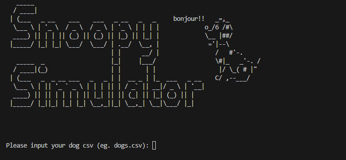

# Snoopy Simulation

A Python-based behavioral simulation that models the interactions between dogs, humans, squirrels, toys, and food in a virtual environment. The simulation accounts for seasonal changes and tracks various aspects of dog behavior.



## Overview

This project simulates the behavior of dogs in a yard environment, accounting for:

- **Dog behaviors**: Movement, energy decay, toy interaction, food-seeking, barking, and boredom
- **Sensory abilities**: Sight, smell (detecting buried toys), and hearing (responding to whistles)
- **Environmental factors**: Seasonal changes (summer/winter) affecting energy decay and squirrel activity
- **Interactions**: With humans (friends, strangers, owners), toys, food bowls, and squirrels
- **Data analytics**: Tracking and reporting behavior patterns and interactions

The simulation uses an object-oriented approach with inheritance to model the different entities and their behaviors.

## Features

### Dogs
- Random movement
- Energy management based on season and activity
- Boredom tracking and alleviating behaviors
- Toy interactions (finding, picking up, playing with, dropping, burying)
- Food-seeking behavior when hungry
- Barking at strangers and squirrels
- Response to human whistling

### Squirrels
- Random movement
- Hibernation during winter
- Fleeing from barking dogs

### Humans
- Different relationship types (Owner, Friend, Stranger)
- Owners replenish empty food bowls
- Friends whistle to bored dogs
- Strangers flee from barking dogs

### Environment
- Seasonal changes affecting energy decay rates
- Map with house, fences, and gates
- Collision detection with map boundaries

## Requirements

- Python 3.x
- Libraries:
  - matplotlib
  - numpy
  - math
  - random
  - csv
  - time

## Usage

1. Clone the repository:


2. Navigate to the project directory:


3. Run the simulation:
   ```
   python snoo.py
   ```

4. When prompted, provide the paths to the CSV files:
   - dogs.csv
   - squirrels.csv
   - humans.csv
   - foodbowls.csv
   - toys.csv

## CSV File Formats

### dogs.csv
```
name,age,colour,position
Max,5,Brown,"100,50"
Charlie,3,Black/White,"120,80"
```

### squirrels.csv
```
name,position
1,"50,50"
2,"150,130"
```

### humans.csv
```
name,relation,position
John,Owner,"30,40"
Jane,Friend,"90,110"
```

### foodbowls.csv
```
position
"50,50"
"120,80"
```

### toys.csv
```
name,position
Bone,"80,80"
Ball,"120,100"
```

## Simulation Analytics

The simulation produces a CSV file (`Simulation_Analytics.csv`) with data on:
- Toy interactions
- Burying vs. dropping preferences
- Food intake patterns by season
- Toy discovery through smell

## Class Structure

- **Animal** (Base class)
  - **Dog** (Inherits from Animal)
  - **Squirrel** (Inherits from Animal)
- **Human**
- **FoodBowl**
- **Toy**

## Future Enhancements

- Weather effects beyond seasonal changes
- More complex nutrition and health tracking
- Relationship development between dogs and strangers
- Additional breed-specific behaviors
